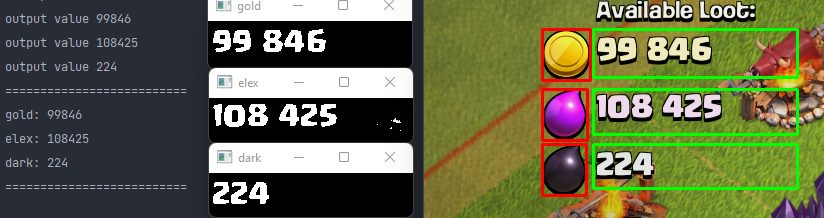

# COC Attack Base Finder

> Note: This code is still under development

## Introduction

This script uses image analysis to see the amount of resources on the villages that are proposed to us to attack and 
passes to the next if it does not contain the minimum value that we want

## Requirements

* [pure-python-adb](https://pypi.org/project/pure-python-adb/)
* [opencv-python](https://pypi.org/project/opencv-python/)
* [pytesseract](https://pypi.org/project/pytesseract/)

## How it works (objective)

By a simple command line you can choose how much you want for each resource and the script will automatically go 
through the villages until it finds a village with the requested resources

## Disclaimer

> This project is just a training on the analysis of data 
> 
> Do NOT use to cheat at the risk of banishment
> 
> I am not responsible for your actions